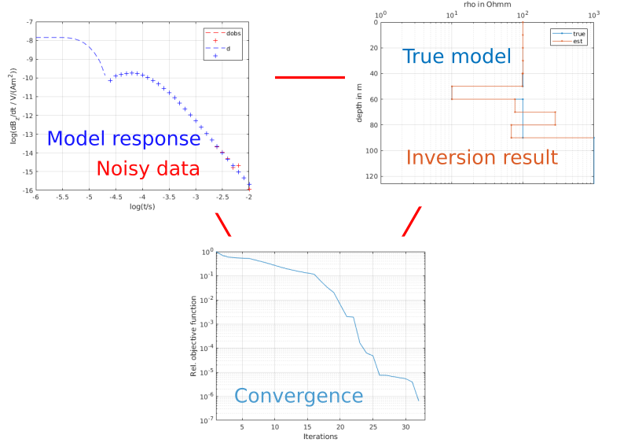
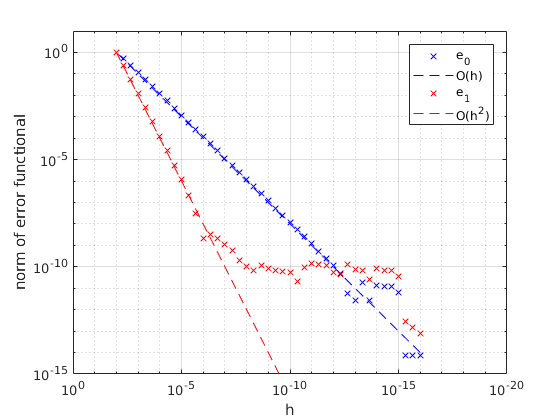
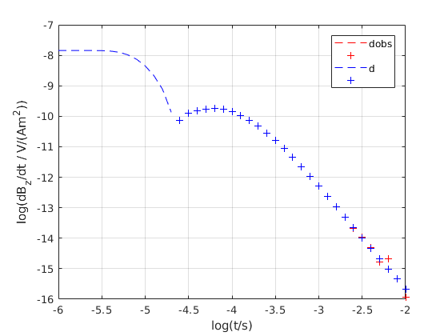
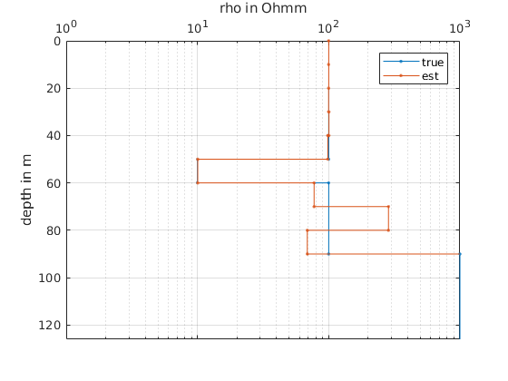
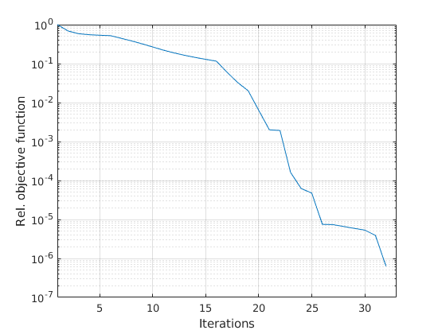

# 1-D Inversion of TEM data


## Introduction
This repository contains a MATLAB implementation for the one-dimensional (1-D) inversion of transient electromagnetic (TEM) data.
Data (currently $\partial_t B_z$) can be either synthetic or real, e.g., as measured by the Geonics Ltd. PROTEM receiver using either TEM-57 or TEM-47 transmitters.

The data inversion is based on a straightforward damped Gauss-Newton approach, where the Jacobian is approximated by small perturbations of the model response.

Model parameters are the layer resistivities.
Layer thickness is supposed to be *fixed*.
Further, it is also possible to keep the resistivity of any given layer fixed.

## Installation
Add installation folder to the MATLAB search path, e.g., using `addpath('<path-to-folder>')`.

## Summary of MATLAB files
```matlab
% TEMINV1D
%
% Files
%   correctRampTime        - add ramp time distortion to transient
%   driverInversion        - example driver for synthetic data
%   driverPROTEM           - example driver for PROTEM data
%   getHankelFC            - provides Fast Hankel transform coefficients
%   getJ                   - calculate Jacobian for current model
%   getVMDLayeredDownward  - VMD evaluation of solution in z > 0
%   getVMDLayeredHarmonic  - VMD in the frequency domain
%   getVMDLayeredTransient - VMD in the time domain
%   getVMDLayeredUpward    - VMD evaluation of layer admittances
%   interp_transient       - interpolate PROTEM onto log-equispaced times
%   minmax                 - evaluate smallest and largest elements
%   plot_model             - plot model
%   plotTransient          - plot transient
%   PROTEM_1D_Inversion    - PROTEM_1D_Inversion inversion of PROTEM data
%   simulate_PROTEM        - simulatePROTEM(t, r, rho, thk, t0)
%   taylortest             - Taylor test for jacobian
%   TEM_1D_Inversion       - TEM_1D_Inversion inversion of synthetic TEM data
```

## Usage
Function calls to `TEM_1D_Inversion` and `PROTEM_1D_Inversion` require *Parameter, Value* pairs.

Both functions use the following parameter-value pairs with the associated default values:

| Parameter | Default value | Explanation |
------------|----------------|------------|
| `'data'` | `[]` | normalized transient data dBz/dt in $V/Am^2$|
| `'times'` | `[]` | transient times in s|
| `'obs'` | `[]` | transmitter-receiver offset in m|
| `'rho'` | `[]` | starting model layer resistivities in Ohm*m|
| `'thickness'` | `[]` | starting model layer thicknesses in m|
| `'fix'` | `[]` | index of layer the resistivy of which is held fixed|
| `'lambda'` | `1e2` | initial value of regularization parameter|
| `'reduce_lambda'` | `1e-1` | factor by which lambda is multiplied when the difference of the objective function between subsequent iterations drops below a value given by `lambda_threshold`|
| `'lambda_threshold'` | `1e-1` | lambda drop tolerance, see `reduce_lambda` |
| `'lambda_min'` | `1e-12` | least permitted value for `lambda`|
| `'pert'` | `1e-6` | relative change in parameter when Jacobian is approximated using small perturbations|
| `'scale_data'` | `@asinh` | function handle for transformation of data and model response |
| `'scale_asinh'` | `1e-12` | scaling of data when transformed by `@asinh` |
| `'maxit'` | `1e2` | stopping criterion: maximum number of Gauss-Newton iterations|
| `'goal_normgc'` | `1e-4` | stopping criterion: iterate until norm of gradient drops below `goal_normgc`|
| `'goal_objective'` | `1e-8` | stopping criterion: iterate until objective function drops below `goal_objective`|
| `'goal_obj_diff'` | `1e-5` | stopping criterion: iterate until the difference of objective function between subsequent Gauss_Newton iterations drops below `goal_objective`|
| `'linesearch-threshold'` | `1e-6` | search direction p can be scaled down until it drops  below `p * linesearch_threshold`|
| `'armijo_c1'` | `1e-4` | Armijo control factor: reduce step length until objective function difference is less than `armijo_c1 * linesearch_step_length * directional_derivative` |
| `'verbose'` | `true` | if true, the function generates more diagnostic output|

## Examples
```matlab
s = tic()
```

### Taylor test of the Jacobian
```matlab
rng('default');
% Model parameters
rho = [1000; 1000; 1000];
m = log(rho);
thk = [20 20];
% Transient times
t = logspace(-6, -3, 31);
nt = length(t);
% Observation point
r = 500.0;

% Area sinus hyperbolicus (asinh) transform with scaling
a = 1e-14;
scalefn = @(rho, a) asinh(getVMDLayeredTransient(...
    [t(1) t(end)], r, rho, thk, 0.0, 1 / a));

% Generate data
dHzdt = getVMDLayeredTransient([t(1) t(end)], r, exp(m), thk, 0.0, 1.0);

% Generate random normalized perturbations
dm = rand(length(m), 1);
dm = dm ./ norm(dm);

% Step length
h = logspace(-16, -2, 43);

% Norm of zeroth and first order Taylor expansions
e0 = zeros(length(h), 1);
e1 = zeros(length(h), 1);

% Jacobian
J = getJ('data', dHzdt, ...
        'rho', rho, ...
        'thickness', thk, ...
        'times', t,
        'obs', r, ...
        'pert', 1e-8, ...
        'scale_data', @asinh, ...
        'scale_asinh', a, ...
        'protem', false);

% Loop through step length values
for k = 1:length(h)
    dHzdt_p = scalefn(exp(m + h(k) * dm), a);
    e0(k) = norm(dHzdt_p - asinh(dHzdt ./ a));
    e1(k) = norm(dHzdt_p - asinh(dHzdt ./ a) - h(k) * J * dm);
end

% Plot
loglog(h, e0 ./ e0(end), 'bx', h, h ./ h(end), 'b--', h, e1 ./ e1(end), 'rx', h, h.^2 ./ h(end).^2, 'r--');
grid();
legend('e_0', 'O(h)', 'e_1', 'O(h^2)');
xlabel('h')
ylabel('norm of error functional')
ylim([1e-15 10])
set(gca, 'XDir', 'reverse');

```
The evaluation of the above code should provide the following figure:



### Inversion using synthetic data
```matlab
rng('default');

% Transient times
t = logspace(-6, -2, 41);
t = t(:);

% True model
rho = [100; 10; 100; 1000];
thk = [50; 10; 30];

% Observation point
r = 100.0;

% Generate data and apply Gaussian noise
dobs = getVMDLayeredTransient([t(1) t(end)], r, rho, thk, 0.0, 1.0);
dobs = dobs + t.^(0.5)  .* randn(length(dobs), 1) * 1e-14;

% Starting model, 10 layers
nl = 10;
% Uniform halfspace, 100 ohm*m
rho_guess = 100 * ones(nl, 1);
% Thickness is 10 m each layer, fixed!
thk_guess = 10 * ones(nl - 1, 1);
% Fix first model parameter, i.e., resistivity of first layer
fixp = zeros(nl, 1);
fixp([1]) = 1;

% Iterate
[rho_new, obj_fn] = TEM_1D_Inversion( ...
    'data', dobs, ...
    'obs', r, ...
    'times', t, ...
    'rho', rho_guess, ...
    'thickness', thk_guess, ...
    'fix', fixp, ...
    'scale_asinh', 1e-12, ...
    'goal_obj', 1e-5, ...
    'goal_obj_diff', 3e-7, ...
    'lambda_min', 1e-10, ...
    'pert', 1e-6, ...
    'verbose', true);

% Plot true and recovered model
figure(2);
plot_model(rho, thk);
hold on
plot_model(rho_new, thk_guess);
hold off
legend('true', 'est');
xlim([1 1000]);

% Plot convergence
figure(3);
semilogy(obj_fn ./ obj_fn(1));
xlabel('Iterations');
ylabel('Rel. objective function');
grid();
xlim([1 length(obj_fn) + 1]);
```
The evaluation of the above code should provide the following figures:






